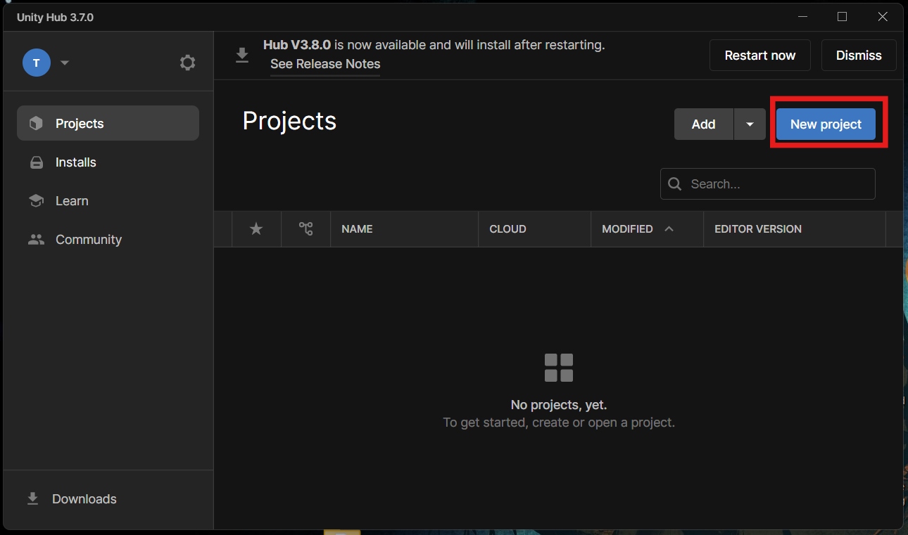

# Unity AR

## Set-up

### Create a new AR project

- Create a new Unity Project in Unity Hub

- Choose the **AR Mobile core** template (you may need to download it first)

The project has a lot of dependancys so may take a while to load the first time.

### Convert to Android

We will be deploying our project to an Android tablet, so need to change the target platform, it is best to do this now before we start.

- In the top menu go to **File > Build settings**

- Choose **Android** and **Switch settings**

- switch build to Android
- show XR Environment
	+ window > XR > AR Foundation > XR Environment
- delete Main camera
- Add Ar session to scene
	+ in Hierachy - right click > XR > AR session
- Add XR origin to scene
	+ in Hierachy - right click > XR > AR Origin (mobile AR)

- press play to test scene
- navigate scene by right clicking and rotating, WSAD, QE

## Create new environment

- In XR Environment
	+ pencil > duplicate > name and save
- in Hieracy
	+ delete simulated tracked image
	+ delete simenvironmentprobe

## marker

### events - trigger 

### marker making guidelines

Size must be at least 300 x 300 pixels. (However, markers do not have to be square!).
Format must be PNG or JPG. 
Image must have a strong color value contrast. 
Image should avoid repeated patterns.

## face

## scan and click to add

