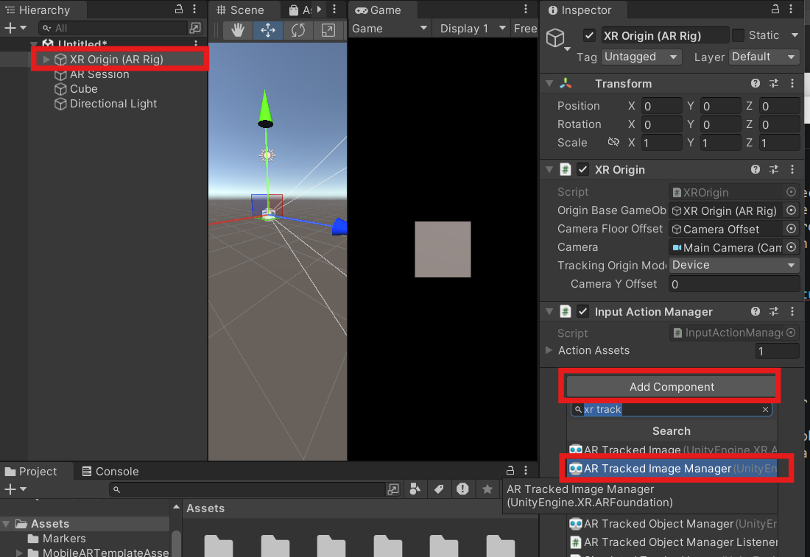
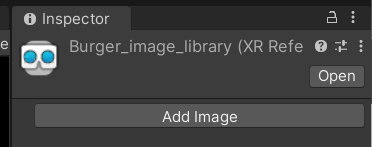
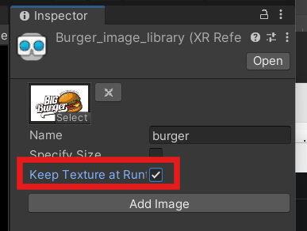
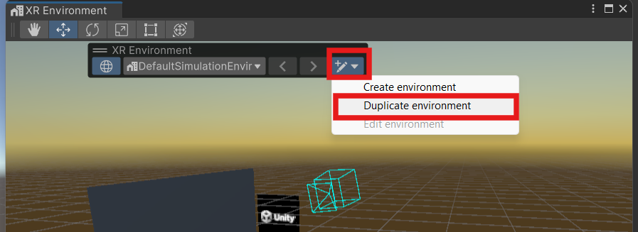
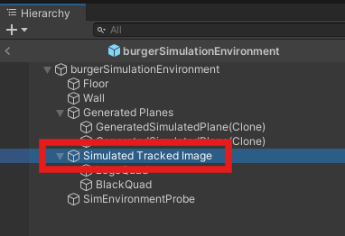
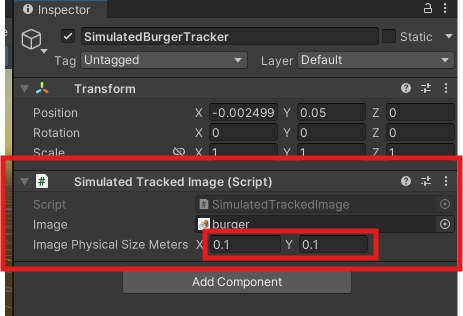
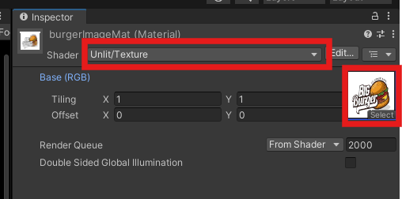

<iframe
  src="https://codepen.io/team/codepen/embed/preview/PNaGbb"
  style="width:100%; height:300px;"
></iframe>


# Unity AR - Tracked Image

This Worksheet will guide you through creating a Augmented reality(AR) tracked image Unity project

The screen shot were created on a PC using Unity version 2022.3.20f1, they may look slightly different on a Mac but as long as you have a similar version of Unity the functionality is the same.

if you get stuck please ask for help.

## 1. Create a new AR project

- Create a new Unity Project in Unity Hub


- Choose the **AR Mobile core** template (you may need to download it first)


The project has a lot of dependencies so may take a while to load the first time.

### Convert to Android

We will be deploying our project to an Android tablet, so need to change the target platform, it is best to do this now before we start.

- In the top menu go to **File > Build settings**

- Choose **Android** and **Switch settings**


AR core is only supported on more recent versions of Android, so we need to set the minimum version.

- In the top menu, go to  **Edit > Project Settings**
- In the **Player** Section find the **Other settings** section
- Change the**Minimum API Level** to **27**.


### New Scene

First we are going to create a brand new scene

- In the top menu go to **File > New Scene**

- Choose **AR** and press **Create**

### Scene Contents

We could have set this up ourselves manualy but using teh AR template saves us time.

The two main things an AR scene needs are an **XR origin** and **XR Session**

- Delete the Cube from the Hierarchy.

#### Save the scene

- In the top menu, go to **File > Save as** and save your scene in the **Scenes** folder. Call it "burger_marker_scene".

## 2. Add an AR tracked image

Our first project is to get a 3D object to appear on an image in the real world. The image could be on your business card or on a poster, product packaging or billboard, anywhere you can put an image and point your camera at it.

- [AR business card](https://www.youtube.com/watch?v=xBYDmauqdaw)

### Tracked Image Manager

Our project needs to look out for our marker image.

- Select the **XR Origin (AR Rig)** object in your Hierarchy and in the inspector, add a **Tracked Image Manager** component.



You should see that this component needs a **Serialized Library**, which is just a list which contains the marker images we want to track and **Tracked Image Prefab** which is the 3D object we want to appear when the camera sees our marker image.

We will first get our marker image.

### Create a tracker image and add it to your project

I have given you a tracker image you can download here:

[burger.png](./assets_for_worksheet/burger.png)

When you create you own, Unity gives the following advise:

- Size must be at least 300 x 300 pixels.
- Format must be PNG or JPG. 
- Image can be black and white or colour but must have strong contrast. 
- Image should avoid repeated patterns.

- Add the image to your project by dragging it into the Assets folder.

#### Reference Image library

We will now create a **Reference Image library** to store our image.

- **Right click** in the Assets panel and choose **Create > XR > Reference Image Library**

- Rename you new library ( I called mine "burger_image_library"

- Select the new library and press **Add Image** in the inspector



- Press **Select** and choose your burger image, or just drag it in from your assets.

- Make sure you turn on **Keep Texture at Runtime**



### Prefab

We want to display a 3D model on the tracker, the model can be as complex as you like, with animations and scripts attached, but for this worksheet we will keep it simple.

Download the model of a burger here:

[burger.fbx](./assets_for_worksheet/burger.fbx)

- Drag your model into the assets panel.

### Connect up the manager

Now we have our image library and prefab we can add them to our tracked image manager.

- Select the **XR Origin (AR Rig)** in the Hierarchy.

- Drag the burger 3d model on to the **Tracked Image Prefab** slot.

- Drag the image library onto the **Serialized Library** slot.


## 3. Simulated Environment

To avoid having to build this project to an actual device every time we want to test it we will create a simulated environment in Unity. This will take time to build, but will save us a considerable amount of time when testing our app.

- On the top menu select **window > XR > AR Foundation > XR Environment**

- Duplicate the default default environment and save it in your assets folder.



This is our simulated real world. 

The Camera in this environment is the camera on your mobile device.

You should see a black square with the Unity logo on it, this represents your physical tracker in the real world.

- Try to navigate around this environment by holding Hold down the **right mouse button**
	+ Move the mouse to rotate.
	+ Press **W,S,A or D** to move.
	+ Press **Q or E** to go up and down.

#### Add our tracked image to the simulated environment

The simulated environment already has a tracked image in it with the Unity Logo on it, We want to create our own with our burger image.

- Select the **Simulated Tracked Image** in the Hierarchy and delete it.



- In the Hierarchy **right click** and choose **Create empty** to make a new empty object.
- Rename it to "simulated burger tracker"
- In the inspector add the **Simulated Tracker Image** component
- Add your burger image to the **Image** slot in the component.
- Change the Physical Size to 0.1 (this is 10 cm, the same size it will be in the real world)



The tracker will now be recognised in the simulation, but we want to add the image to make it look correct.

- **Right click** and create a new quad inside this new object and rename it to "ImageQuad".


We now need to add the tracked image to the quad as a material.

- Create a new materials by **right clicking** in the Assets panel and choosing **Create > material**
- Rename the material "burgerImageMat".
- In the Inspector, change the shader to **Unlit/Texture** and add the burger tracker image as the texture.



- Drag the new material onto the Quad you made earlier.


- Finally, scale your quad down to 0.1, and rotate by 90 in X.


### Test your simulation

Now that we have a simulated environment with a simulated tracked image in it we can test our scene.

- Press the play button 

- Navigate around your scene you should see the 3D burger appear on the marker.


Make sure the burger sits centrally on the marker.

This simulated environment allows you to test without having to build your scene to a proper device. You can add props such as tables and chairs to make it look more like a real room, then position your tracker image appropriately in the environment, this can help to make sure you have the scale correct.

However, we are happy that the burger appears so will now test on a real device.

## 4. Test on a device

Now that we have successfully tested our project in the simulated environment we can try it on a real device.

As this process with be the same every time you build to android I have made a seperate guide showing you how to do it.

[Build to an android device](./build_to_android.html)

### Testing

We are expecting the burger 3D model to appear on our burger tracker image.

You can just use an image on your screen but printing it out will give you a better result.

You should see a the burger model appear on your screen locked to the tracking image.

Try moving the device and tracking object around and see how it responds.

## 5. Challenges

Now that we have completed a basic AR project we can take it 
further in a few ways.

### Challenge 1

Replace the burger with a different 3D object, choose something with an animation.

### Challenge 2
Add a script to detect when a marker is found. 

This script will listen for new tracked images and place and place a 3D prefab model on to them. you could extend it to check the name of the tracked image and place a different prefab.

```
using UnityEngine;
using UnityEngine.XR.ARFoundation;

public class MyTrackedImages : MonoBehaviour
{
	private ARTrackedImageManager m_TrackedImageManager;
	[SerializeField]
	public GameObject myPrefab ;
	
	void OnEnable() => m_TrackedImageManager.trackedImagesChanged += OnChanged;
	
	void OnDisable() => m_TrackedImageManager.trackedImagesChanged -= OnChanged;
	
	/**
	** Detect when tracked images change
	**/
	void OnChanged(ARTrackedImagesChangedEventArgs eventArgs)
	{
	    foreach (var newImage in eventArgs.added)
	    {
	        // Handle added event
	        Debug.Log(newImage.referenceImage.name);
	        
	        // check name of tracked image
	        if( newImage.referenceImage.name == "tracked image name"){
	        // create a copy of my prefab at the location of the tracked image
	        Instantiate(myPrefab, newImage.transform);
	        
	        }
	    }
	
	    foreach (var updatedImage in eventArgs.updated)
	    {
	        // Handle updated event
	    }
	
	    foreach (var removedImage in eventArgs.removed)
	    {
	        // Handle removed event
	    }
	}
}
```

[Unity documentation](https://docs.unity3d.com/Packages/com.unity.xr.arfoundation@5.1/manual/features/image-tracking.html)

## References

- [Burger model](https://skfb.ly/onCMo)
- [Burger image](https://www.vecteezy.com/vector-art/17503957-hot-burgers-vector-logo-illustration-modern-burgers-emblem-vector-art)
- [Unity AR Foundation documentation](https://docs.unity3d.com/Packages/com.unity.xr.arfoundation@5.0/manual/features/image-tracking.html)
